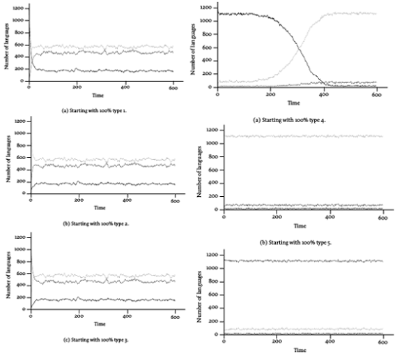
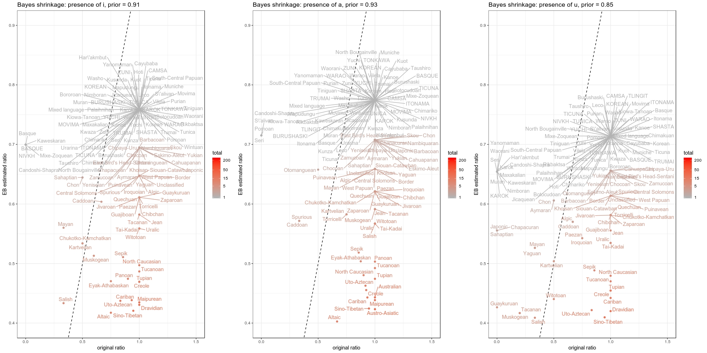

```{r, include=FALSE}
knitr::opts_chunk$set(echo = FALSE, message = FALSE, error = FALSE)
library(tidyverse)
theme_set(theme_bw())
```

## Два вида статистики

В статистических исследованиях существует несколько школ, основые (см. [@efron16]):

1) фриквентистская
2) байесовская

## Разница подходов

В любой задаче мы пытаемся оценить некоторый параметр θ генеральной совокупности.

### Фриквентисткий подход

Фриквентисткий подход исходит из идеи, что есть некоторая генеральная совокупность из которой мы берем выборки и оцениваем параметр θ̂. Таким образом параметр считается фиксированным, а оценка, полученная на основе выборки --- результат независимого эксперимента. Результаты разных экспериментов должны быть основаны на разных выборках, а различия, полученные в результате разных экспериментов объясняются флуктуацией выборки.

* параметр θ -- фиксирован
* данные варьируются

### Байесовский подход
В байесовском подходе всему, в том числе оцениваемому параметру приписывается вероятностное распределение, которое получается по формуле Байеса из априорного распределения (некоторые изначальные предположения о природе θ) и оценки, полученных из выборки.

* параметр θ -- носит вероятностный характер
* данные фиксированы

## Подходы к типологическому исследованию

### Фриквентистский

* Создаем **репрезентативную** выборку языков
* Оцениваем интересующий нас параметр
* При повторном исследовании пересобираем выборку

### Байесовский

* Собираем в априорное распределение наши ожидания, предыдущие работы и т. п.
* Создаем выборку языков
* Обновляем наши ожидания при помощи данных из выборки

## Что потом можно сделать с полученными оценками?

* написать статью
* построить марковские цепи [Manova 2000], [Widmann 2001]

Переходы из одного типа в другой:

| P(VSO → VSO) | P(SVO → VSO) | P(SOV → VSO) |
|--------------|--------------|--------------|
| P(VSO → SVO) | P(SVO → SVO) | P(SOV → SVO) |
| P(VSO → SOV) | P(SVO → SOV) | P(SOV → SOV) |

Произвольные вероятности из [Widmann 2001]:

| 0.90 | 0.02 | 0.01 |
|------|------|------|
| 0.09 | 0.90 | 0.09 |
| 0.01 | 0.08 | 0.90 |

## Markov chains [Widmann 2001]

Type 1: VSO; Type 2: SVO; Type 3: SOV




## Недостатки фриквентистского подхода: репрезентативность выборки

* [@bell78] "Language Samples"
* [@dryer89] "Large Linguistic Areas and Language Sampling"
* [@perkins89] "Statistical Techniques for Determining Language Sample Size"
* [@nichols92] "Linguistic Diversity in Space and Time"
* [@rietveld93] "Statistical Techniques for the Study of Language and Language Behaviour"
* [@rijkhoff98] "Language sampling"
* [@maslova00] "A dynamic approach to the verification of distributional universals"
* [@widmann01] "Language Sampling for Typological Studies"
* [@janssen06] "Randomization Tests in Language Typology"
* [@bakker10] "Language Sampling"

## Недостатки фриквентистского подхода: репрезентативность выборки

* генетические
* контакты
* ? культурные
* типологические
* библиографические
* популяционные

## Недостатки байесовского подхода: априорное распределение

* эта технику ругают за субъективизм
* математическая сложность (лингвистам трудно все, что не пропорция/проценты)

## Мое предложение

* Единицей исследования можно считать языковую семью
* Исследуем все доступные материалы по выборке семей
* Нет выборкам (но если очень нужно их можно делать из всех доступных данных)
* Не обязательно ждать конца исследования, чтобы получить результаты (Байесовское мышление)
* Сравниваем внутригрупповую дисперсию признака с дисперсией по всем группам
  * получаем ответ на вопрос, что редко, что часто
  * получаем "ответ" на вопрос: типологическое  vs. ареальное vs. генеалогическое
* Empirical Bayes Estimation
* Missing species problem

## Empirical Bayes Estimation: общее

Empirical Bayes Estimation [@robbins85] --- это техника, которая позваляет получать априорное распределение на основании большого количества данных. 

* Допустим у нас есть несколько языковых семей (с разным количеством языков)
* Для каждого языка мы выясняем параметр θ (например, есть абруптивные звуки?)
* Дальше для каждой языковой семьи мы получаем долю языков с интересующим нас параметром
* Отсекаем семьи с малым количеством языков (я брал семьи с количеством языков больше 5)
* Оцениваем бета распределение (α --- количество успехов, β --- количество неудач), которое описывает распределение долей в языковых семьях
* Используем полученные параметры бета распределения в качестве априорного распределения для того, чтобы обновить наши данные
* Исследуем выбросы

## Empirical Bayes Estimation: пример 1

Допустим, что мы получили парметры оценки 5 успехов и 15 неудач. Какую оценку получит языковая семья, в которой два языка и оба с абруптивными?

```{r}
alpha <- 2
beta <- 0
data_frame(x = rep(seq(0, 1, 0.01), 3),
           d = c(dbeta(seq(0, 1, 0.01), alpha, beta),
                 dbeta(seq(0, 1, 0.01), 5, 15),
                 dbeta(seq(0, 1, 0.01), alpha+5, beta+15)),
           распределение = rep(c("данных", "априорное", "апостериорное"), each = 101)) %>% 
  ggplot(aes(x = x, y = d, color = распределение))+
  geom_line() + 
  labs(x = "вероятность иметь абруптивные в языке", y = "")
```

## Empirical Bayes Estimation: пример 2

Допустим, что мы получили парметры оценки 5 успехов и 15 неудач. Какую оценку получит языковая семья, в которой два языка и оба не имеют абруптивных?

```{r}
alpha <- 0
beta <- 2
data_frame(x = rep(seq(0, 1, 0.01), 3),
           d = c(dbeta(seq(0, 1, 0.01), alpha, beta),
                 dbeta(seq(0, 1, 0.01), 5, 15),
                 dbeta(seq(0, 1, 0.01), alpha+5, beta+15)),
           распределение = rep(c("данных", "априорное", "апостериорное"), each = 101)) %>% 
  ggplot(aes(x = x, y = d, color = распределение))+
  geom_line() + 
  labs(x = "вероятность иметь абруптивные в языке", y = "")
```

## Empirical Bayes Estimation: пример 3

Допустим, что мы получили парметры оценки 5 успехов и 15 неудач. Какую оценку получит языковая семья, в которой двадцать языков и 19 не имеют абруптивных?

```{r}
alpha <- 19
beta <- 1
data_frame(x = rep(seq(0, 1, 0.01), 3),
           d = c(dbeta(seq(0, 1, 0.01), alpha, beta),
                 dbeta(seq(0, 1, 0.01), 5, 15),
                 dbeta(seq(0, 1, 0.01), alpha+5, beta+15)),
           распределение = rep(c("данных", "априорное", "апостериорное"), each = 101)) %>% 
  ggplot(aes(x = x, y = d, color = распределение))+
  geom_line() + 
  labs(x = "вероятность иметь абруптивные в языке", y = "")
```

## Empirical Bayes Estimation: исследуем выбросы

* База данных PHOIBLE



## Спасибо!

Г. Мороз (agricolamz@gmail.com)

Ссылка на презентацию: [https://tinyurl.com/ybtpprzk](https://tinyurl.com/ybtpprzk)

## Referenses {.smaller}
